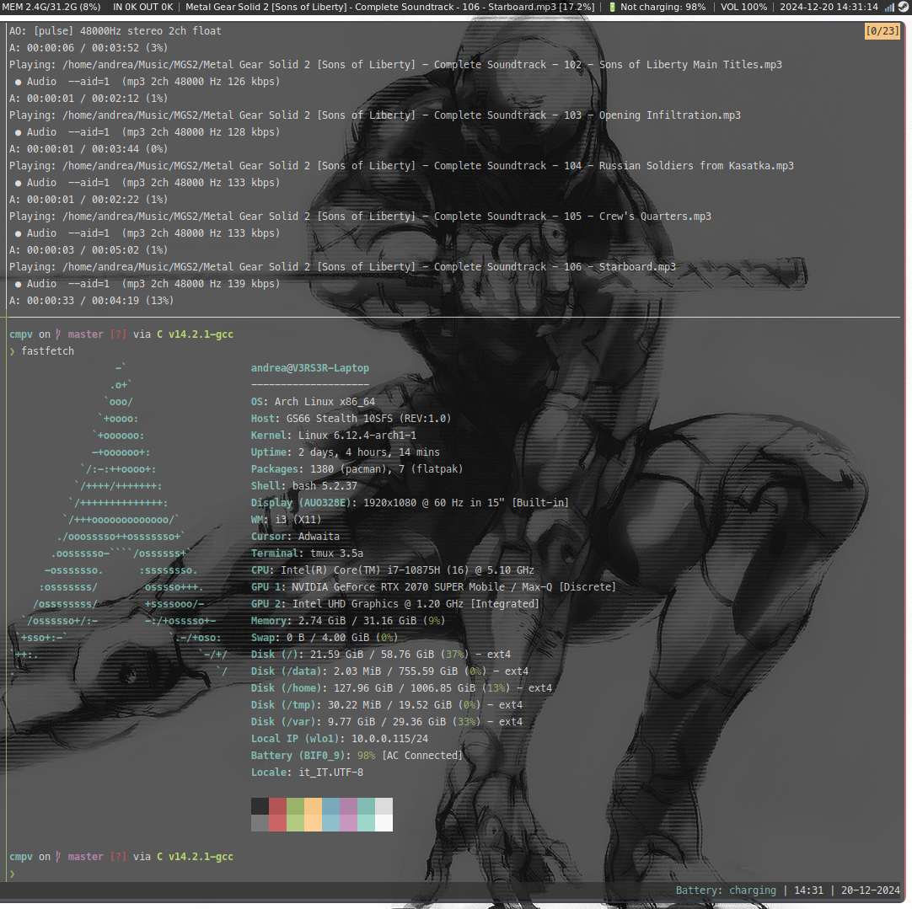

# CMPV

CMPV is a small project I created for fun to monitor the status of MPV and integrate seamlessly with i3blocks. Written in C, it provides a simple and efficient way to display whether MPV is running directly on your i3 status bar. It’s lightweight, minimalist, and does exactly what I needed—nothing more, nothing less.

---

## Why CMPV?

Honestly? I just wanted to build something for myself. I love using MPV and i3, and I thought it would be cool to have a little tool that shows me if MPV is running or not, right on my status bar. CMPV was born out of curiosity and the desire to tinker with C, i3blocks, and MPV's IPC interface. If you find it useful, that’s awesome—but for me, this was just a fun side project!

---

## Demo with cmpv 


## Features
- Real-time monitoring of MPV's status.
- Seamless integration with [i3blocks](https://github.com/vivien/i3blocks).
- Lightweight and optimized for minimalist environments.
- Built with simplicity in mind: no extra dependencies beyond what’s necessary. [nobuild](https://github.com/tsoding/nobuild)  

---

## Requirements
- **MPV**: Must be installed and configured to use IPC sockets.
- **i3blocks**: To integrate CMPV into the i3 status bar.
- **C Compiler**: Required to compile the source code.

---

## Installation

1. Clone the repository:
```console
$ git clone git@github.com:Andrew0x2/cmpv.git
$ cd cmpv
```

2. Compile the application:
```console
$ cc -o mpv_monitor mpv_monitor.c -ljson-c
```
Or use `nob` (a lightweight build system):

```console
$ cc -o nob nob.c
$ ./nob
```

3. Configure i3blocks:
Edit your i3blocks configuration file (usually located at `~/.config/i3blocks/config`) and add a new entry:

```console
[mpv]
command=/absolute/path/to/mpv_monitor
interval=5
```

4. Reload i3 configuration:
```console
i3-msg reload
```

---

## Usage

Run the application directly from the terminal:
```console
./mpv_monitor
```

Or let i3blocks execute it automatically.

### Output
- 🚫 - *Mpv is not executed*: MPV is not running.
- ✅ - *Mpv is running*: MPV is active.

---

## Screenshots

### CMPV Integrated with i3blocks


### CMPV with MPV Not Running


---

## Demo Video

Watch CMPV in action:

[](videos/cmpv_demo.mp4)


---

## Acknowledgments

A big thank you to **tsoding** for providing [`nob.h`](https://github.com/tsoding/nobuild). Your work is inspiring!

---

## Contributions

This project was something I built just for myself, but if you find it interesting or want to improve it, feel free to contribute! Open an issue, submit a pull request, or just fork it and make it your own.

---

## Fun Fact

I built CMPV while experimenting with MPV's IPC interface and learning more about how i3blocks works under the hood. It started as a small idea but turned into something I now use daily—and that’s pretty cool!

---

## Final Thoughts

Thanks for checking out CMPV! This was a fun little side project for me, and I hope you enjoy using it as much as I enjoyed building it. If you have any ideas or feedback, don’t hesitate to reach out or open an issue. Happy coding! 🚀
